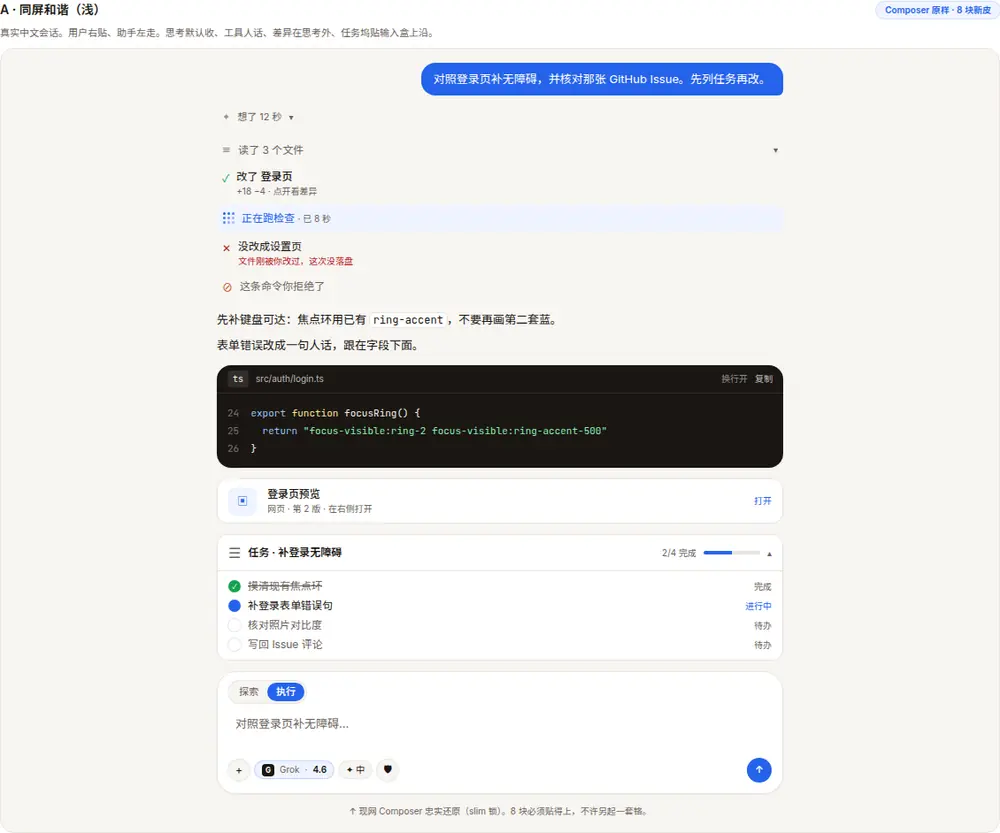
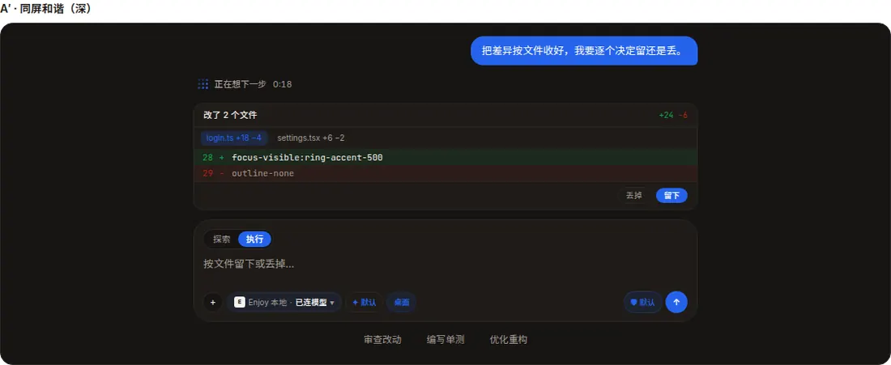
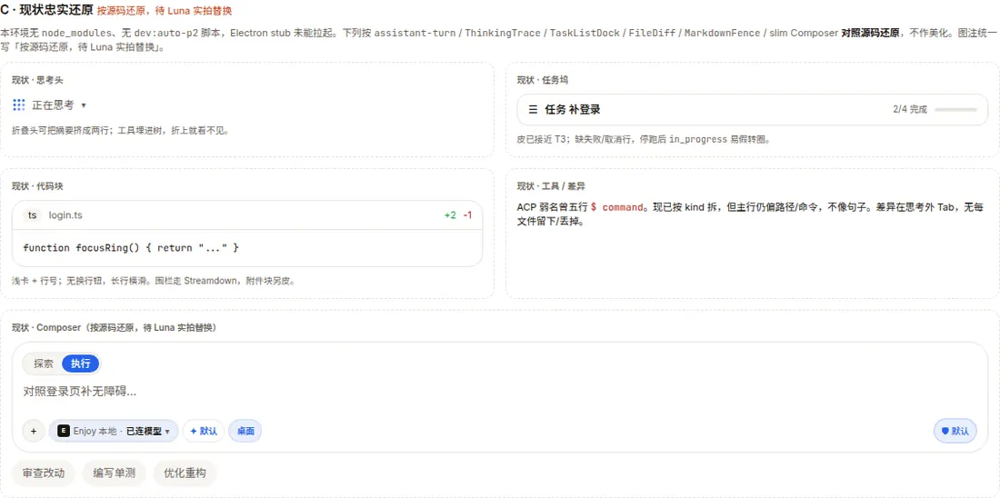

# 对话侧 AI 组件统一视觉

> 设计锁（Luna）。预览 [`../previews/ai-blocks-unify.html`](../previews/ai-blocks-unify.html)。Composer **不动**。I3 / virtua **暂停**。不是当前真相，落地以 `ui` spec 为准。
>
> 抓取日：2026-10-09。只引用亲开过的页。

## HextaUI 拆解

**站点**：https://hextaui.com/blocks · 目录 https://hextaui.com/blocks/llms.txt  
**免费库**：https://github.com/preetsuthar17/HextaUI · **MIT**（组件 / hook / 工具）  
**AI 块**：HextaUI **Pro**（22 块；AI 向约 13：Agent Todos / Artifact / Chat Thread / Code Block / Diff Review / Markdown / Streaming / Thinking / Tool Calls / Prompt Input / Chat Sidebar / Voice Mode / HextaAI）。安装走私有 registry + token。  
**Pro License**（https://hextaui.com/legal/license，2026-10-08）：买后可改、可进终产品；**禁止**再分发源码、禁止做竞品 UI 库、禁止拿 Pro 代码训模型。Prompt Input 免费可装，其余 AI 块 **仅参考，不可取用源码**。  
**栈**（about + llms.txt）：React / Next.js · shadcn CLI 复制源码 · **Tailwind CSS v4** · **Base UI**（`@base-ui/react`，`render` 不是 `asChild`）· **AI SDK `useChat` / `UIMessage` parts** · 图标 `@tabler/icons-react` · 代码 **Shiki**（GitHub light/dark）· Markdown 可挂 **Streamdown** · 动效自研（interruptible + `prefers-reduced-motion`），不是 framer 默认皮。

实拍 iframe：`/opt/cursor/artifacts/ai-blocks/ref-hextaui-*.png`；入库缩图 `../previews/assets/ai-blocks/`。

| 块 | 层级 | 密度 | 开合 | 状态 | 动效 | 深色 |
|---|---|---|---|---|---|---|
| **Agent Todos** | 列表 + 进度条 + 解释；Composer 上沿 `Status` 药丸；跑前 `Review` | 一行一步；>6 条折掉已完成 | 头可折；步骤可展开细节（工具） | `backlog / pending / in_progress / completed / failed / cancelled`；失败留原因；计划变更高亮 | 进行中环；减动立刻打勾 | 预览 iframe 浅/深都有；药丸跟 Composer |
| **Artifact** | 对话卡 + 右侧/底栏 `Workspace`（桌面分栏，手机底 sheet） | 卡一行：标题·类型·版；预览不进气泡 | 流式自动开（宽屏）、点卡开、Esc 关；焦点不抢输入盒 | `streaming / complete / stopped / error`；编辑失败留上一版 | 写入跟行；写完才切预览；减动整段淡入 | 分栏浅色定价页实拍；深色同构 |
| **Chat Thread** | 空态中置 Composer → 有消息钉底；用户右泡、助手左；右侧 checkpoint | 动作悬停；最后一条常驻 | 用户句可 pin 顶；历史向上补 | `streaming / error / stopped`；重试变版本 | 跟流滚动，人一滑就停 | 实拍深色：折合「Thought for 3s」+ 底栏 Composer（**我们不抄这只输入盒**） |
| **Code Block** | 头（语言/文件）+ 动作 + 代码 + 可选审查条 | >16 行「Show all」 | 审查 `pending / accepted / rejected` | 流式增量高亮；diff 带 +/- | 跟新行；减动无打字 | 实拍：上块源码、下块 unified diff +2/−1 |
| **Diff Review** | 摘要卡「Edited N files」+ 树 + 工具条 | 已决折成一行 stub；>400 行先 Load | 每变更 / 每文件 / 全部；U 撤销 | `pending / accepted / rejected`；`streaming` 不能决；`stale` 只能拒 | 词级高亮；减动折合无动画 | 实拍摘要：四文件 + Accept all |
| **Markdown**（流式正文） | Streamdown 元素：标题/表/GFM/任务列表/引用 | 对话 `sm`，文章 `base` | 表可复制 md/csv | `streaming` 补全半截语法 + 光标 | 默认 90 字/秒，积压约 0.3s 追上；减动停光标 | 实拍浅：表 + 代码 + 任务列表 |
| **Streaming** | `StreamingText` / `useSmoothText` 可垫任何渲染器 | 纯文本 | 无 | `streaming` 才有光标 | 同上；emoji 不切；减动去淡入 | 实拍深色：光标在句末 |
| **Thinking** | 状态行（orb + 现态 + 计时）+ 轨迹（搜索/来源/推理）+ 引用正文 | 折头一句 | 流式默认开，结束自动折（人动过则尊重） | step `active / done`；`kind: search/read/think/code` | shader orb + shimmer；减动静帧 | 实拍：浅「Reading 3 of 3」/ 深「Thinking 6s」 |
| **Tool Calls** | 一句一行；只读连续收成「Explored N」 | 改/命令/审批/错各自一行 | 点开才见文件/diff/终端 | `streaming / running / waiting / approval / done / error / denied / cancelled` | 跑着计时；非 0 退出自动展开 | 实拍：搜索收折 + 创建文件展开代码 |

HextaUI 可学：**句子化主行、只读合并、流式完自动折、状态互斥、减动**。不学：shader orb、英文「Thought for」、GitHub 代码皮、把 Composer 收成一条胶囊（Enjoy slim 已锁）。

## 其它参考（均已打开或核到许可证页）

只列亲开过的。X 原文 403，不拿推文当证据。

| 来源 | 链 | 许可 | 最擅长 | 一句 | 取用 |
|---|---|---|---|---|---|
| Vercel AI Elements | https://elements.ai-sdk.dev/ · https://github.com/vercel/ai-elements | **Apache-2.0**（LICENSE 原文） | Conversation / Message / MessageResponse(=Streamdown) / Task / Tool | 本仓已经在用，皮要 BoardUI | 可作依赖；勿上 registry 默认皮 |
| shadcn 对话原语 | https://ui.shadcn.com/docs/changelog/2026-06-chat-components · InfoQ https://www.infoq.com/news/2026/08/shadcn-conversational-primitives/ · https://ui.shadcn.com/docs/components/base/message-scroller | MIT（shadcn 复制源码） | **Chat Thread 滚动**：MessageScroller / Message / Bubble / Attachment / Marker | 不管模型状态，只管锚点/跟流/补历史。I3 候选 | **I3 暂停**，本文不锁接入 |
| prompt-kit | https://www.prompt-kit.com · https://github.com/ibelick/prompt-kit | **MIT** | Reasoning 自动折 · Markdown 按块 memo · CodeBlock+Shiki | 流式 Markdown 的分块缓存值得看 | 可抄交互；已有 Streamdown 则不必换 |
| assistant-ui | https://www.assistant-ui.com · https://github.com/assistant-ui/assistant-ui | **MIT**（可选 Cloud 付费） | Thinking 分组 · Tool UI 审批 | `GroupedParts` 把推理+工具收成一段 | 运行时太重，不引进整库 |
| Pasta UI | https://pastaui.com/llms.txt · https://github.com/syeddhasnainn/pastaui | 开源件 **MIT**（LICENSE 2026）；**Pasta UI Pro** 另售 | Tool Approval / File Diff / Reasoning Text / Todo List（50+ AI 件目录属实） | 审批卡、文件 diff、推理折合最贴近 Agent IDE | 开源件可抄；Pro **仅参考，不可取用源码** |
| React Spectrum AI | https://react-spectrum.adobe.com/ai-components | Adobe 开源（Spectrum 系 Apache-2.0；本页未再下载到 LICENSE 正文） | PromptField / 附件 / 语音 · **Composer 向** | 无 Tool/Diff/Thinking 深度 | Composer 已锁，本文不改 |
| shadcncraft AI Chat | https://shadcncraft.com/apps/ai-chat · 价 https://shadcncraft.com/pricing | **付费** Pro React $249 / Figma+React $499，一次买断 | 整聊 App + 七种 part 渲染 | 完整但贵 | **仅参考，不可取用源码** |
| Planes | https://useplanes.com | **付费** Planes Pro，一次买断、不退 | AI Chat / Prompt Composer / Chat Orb | 营销向，orb 跟 Enjoy 性格冲突 | **仅参考，不可取用源码** |

未核到正文、不引用：`x.com/syeddhasnainn/status/2105313855727411308`、`x.com/toolfolio/status/2086492914117410937`、`x.com/shadcncraft/status/2095822250062876932`、`x.com/Ashishgogula/status/2107433896464072734`（均 403）。公开站已足够判断付费/开源。

## 现状（代码，2026-10-09）

| 块 | 入口 | 现在长什么样 |
|---|---|---|
| 线程 | `assistant-turn.tsx` / `user-turn.tsx` / AI Elements `Message` | 助手 `max-w-[40rem]`；思考 → 工具表面 → 正文；无 MessageScroller |
| 思考 | `thinking/thinking-trace.tsx` + `step-tree/*` | Beautiful UI Drive 3×3 + 流光；有工具默认折；字数进 title |
| 工具 | `thinking/step-tree/tool-step-row.tsx` + `tool-surfaces/` | 同质只读合并；diff 在思考**外** Tab；主行偏路径/`$ cmd` |
| 差异 | `diff/file-diff.tsx` + `packages/agent-core/src/diff.ts` | 自研 hunk，无 @pierre / diff2html / react-diff-view；无每文件留下/丢掉 |
| 代码 | `thread/markdown-fence.tsx` + `ai-chat-code-block.tsx` + `syntax/use-shiki-html.ts` | Streamdown 围栏；shiki CSS 变量；附件块另一张浅卡 |
| Markdown | `thread/markdown-response.tsx` → `MessageResponse` = **Streamdown** | 已接 copy；无独立 pacing 光标 |
| 任务 | `composer/composer-todo-dock.tsx` + `packages/ui/.../task-list-dock.tsx` | T3 坞、n/m、圆点；停跑应「已停止」；无 failed/cancelled 行 |
| 产物 | 无独立 Artifact 面板 | 生图/视频走 Image Generation；预览走右栏 Browser / `openPreview`，不是版本化产物 |
| Composer | `ai-chat-composer.tsx` **本锁不改** | 圆角 22、`BorderBeam` ocean、顶探索\|执行；底栏 `AgentPicker`「Enjoy 本地 · {模型}」、思考档「默认」、CU 就绪「桌面」、审批盾「默认」；盒下空态 pill 审查改动 / 编写单测 / 优化重构。预览不编模型名，写「已连模型」。 |

**按源码还原，待 Luna 实拍替换**：环境无 `node_modules`、仓库无 `dev:auto-p2`。预览 C 节与对比表现状列按源码还原，不冒充应用窗口实拍。

## 视觉语言（Enjoy，不抄 HextaUI 皮）

与 slim Composer、Agents 语义色（ink / mute / line / paper / card / accent）同族。

| 类 | 值 |
|---|---|
| 圆角 | 6 徽标 · 10 行钮 · **12 卡片** · **16 代码/差异** · **22 Composer 禁止改** |
| 间距 | 4 图标隙 · 6 行内 · 8 块内 · 12 块间 · 16 区隔 |
| 层 | page=`paper` · card=白/`card` · inset=浅槽 · code=`#1A1612` 墨底（深浅都用墨底代码，避免两套高亮皮） |
| 字 | 题 14 semibold · 正文 13 · 辅助 11 · 元数据 10 · 等宽 JetBrains / `font-mono` |
| 标 | Remix 14 行内 / 16 头；品牌 Lobe；**思考继续 3×3 Drive**，不要 orb |
| 状态 | 跑=`accent` 流光 · 成=`ok` · 警=`warn` · 错=`danger` · 跳过/拒=`mute`+⊘ |
| 动效 | 展开 180ms · 收 120ms · 光标 1s step · 流光 1.4s · Drive 1.1s；`prefers-reduced-motion`：无闪、立刻开合、光标静止 |
| 禁 | 假 %、Hero、serif 斜体口号、主表面 `desktop_act` / bundle id / TTL / HMAC / ToolLoop |

## 分块规格

### 任务
- **在哪**：Composer 上沿坞，同宽。有改动时改动进 footer，不叠第二张卡。
- **态**：待办 / 进行中 / 完成 / **已停止**（`running===false` 且未完成）/ 失败（有错误句才画）。不要 backlog 英文。
- **开合**：点标题；全完成默认折。
- **文案**：`任务 · {短名}` · `{n}/{total} 完成` · 右侧 `进行中` / `待办` / `已停止` / `失败`。禁止「TodoWrite」。

### 产物
- **在哪**：助手轮一张卡；打开 = 右栏已有 Browser / Files，不新造第三栏。
- **态**：正在写入（不给预览）/ 可打开 / 预览失败（「修一下」回对话）。版本点开才见。
- **文案（默认）**：`{人话标题}` · `网页` · `在右侧打开`。禁止 `create_artifact`。
- **待定变体**：`网页 · 第 2 版` 只画在标明「待定变体」的稿里。版本时间线仍是开放问题，默认卡不写「第 N 版」。

### 对话线程
- 用户右、accent 泡；助手左、无灰底大泡。
- 底脚：复制 / 从此处分叉（非流式且有正文）。
- 刻度轨规则维持 ui spec。I3 不换滚动库。

### 代码块
- 头：语言徽标 + 文件名 + 换行 + 复制。下载可选、默认关。
- 长行可换；>16 行「显示全部」。
- 流式：未闭合围栏不闪；光标在最后一行。
- 继续 shiki token，不要 GitHub 主题名写上 C 端。

### 差异审查
- 思考**外**；多文件 Tab。
- 每文件 **留下 / 丢掉**（对现网 Keep/Undo All 的文件级补充；未接线先画）。
- 色走 `diff-palette`；不要只靠红绿。
- 文案：`改了 N 个文件` · `留下` · `丢掉`。禁止 `Accept hunk`。

### 流式 Markdown
- **继续 Streamdown**（已在 `MessageResponse`）。
- 半截语法补全；光标仅 `streaming`。
- 链接点进右栏浏览器（已有）。

### 思考
- 头：Drive + `{人话}` + `{实测秒}`。结束：`想了 {n} 秒`。
- 有工具默认折；人点过则记住。
- 折头单行 truncate；字数 `title`。
- 不要 orb、不要「Thought for」。

### 工具行
- 主行句子：`读了登录页` / `改了 2 个文件` / `正在跑检查` / `没改成设置页` / `这条命令你拒绝了`。
- 只读连续 ≥2 合并，默认折。
- 改 / 命令 / 失败 / 拒绝 **不**合并。
- `desktop_act` 主行「要点一下 Safari」；bundle / HMAC 进展开。
- 态：跑 / 成 / 败 / 拒 / 取消（Stop 后未完成 = 取消，不许转圈）。

## C 端自检

- [x] 无假进度 %、无假「已完成」
- [x] 无营销 Hero / serif 口号
- [x] 列表紧：合并只读、折思考、坞同宽
- [x] 主文案中文、人话
- [x] 主表面无 `desktop_act`、bundle id、TTL、HMAC、ToolLoop
- [x] Composer 未改
- [x] I3 未开

## 现状 vs 新版

> 现状列与下图均为 **按源码还原，待 Luna 实拍替换**。Luna 会从真机跑补应用窗口图。Hexta 参考图是站点 iframe 实拍，不是 Enjoy 窗口。

| 块 | 现状（按源码还原，待 Luna 实拍替换） | 新版 | 图 |
|---|---|---|---|
| 任务 | T3 坞已有；缺失败/停跑诚实 | 补「已停止」「继续」；仍贴 Composer | 预览 B1；Hexta 参考 `assets/ai-blocks/ref-hextaui-agent-todos-light.webp` |
| 产物 | 无独立卡，预览散落右栏 | 一张卡 → 右栏；写入中不给假预览；默认无版本号 | `ref-hextaui-artifact-light.webp` |
| 线程 | Message 已有，滚动自管 | 皮统一；**不换 I3** | `ref-hextaui-chat-thread-light.webp` |
| 代码 | 浅卡附件 + Streamdown 围栏两套皮 | 统一墨底代码卡 + 换行 + 复制 | `ref-hextaui-code-block-light.webp` |
| 差异 | 自研 FileDiff，无每文件决 | Tab + 留下/丢掉 | `ref-hextaui-diff-review-light.webp` |
| Markdown | Streamdown，无光标 | 保留库，加流式光标 | `ref-hextaui-markdown-light.webp` / `streaming-*.webp` |
| 思考 | Drive 已对；折头易挤 | 单行 +「想了 n 秒」 | `ref-hextaui-thinking-light.webp` |
| 工具 | kind 已拆，主行不像句子 | 句子化 + 四态 | `ref-hextaui-tool-calls-light.webp` |

新版浅：

新版深：

现状（按源码还原，待 Luna 实拍替换）：

## 实现路径（mike 填）

> **草稿，待 mike 确认。** Luna 只锁皮与文案，不锁装包。

### 当依赖 vs 手写

| 件 | 建议 | 理由 |
|---|---|---|
| 思考头 / 步骤树 | **手写 restyle** 现有 `ThinkingTrace` | Drive 已是 Enjoy 性格；不要 Hexta orb、不要整库 assistant-ui |
| 工具行 | **手写** 主行文案层，复用 step-tree | 句子化 + 人话映射；审批仍走 PermissionDock |
| 任务坞 | **留** `TaskList` / Dock，补停止/失败 | 已 T3；Hexta AgentTodos **不可装** |
| 产物卡 | **手写** 薄卡，打开走现有右栏 | 不要 Hexta ArtifactWorkspace |
| 线程滚动 | **不动**（I3 暂停） | 以后再评 `@shadcn/react/message-scroller` |
| Composer | **不动** | slim 锁 |
| HextaUI Pro / shadcncraft / Planes / Pasta Pro | **不装** | 许可证或性格不合 |

### 流式 Markdown

- **今天**：`packages/ui` 已依赖 `streamdown`；`MessageResponse` 包一层；围栏 `components.code`。
- 选项：① 继续 Streamdown（推荐）② `react-markdown` + `remark-gfm` + 按块 memo（prompt-kit 路，重复造）③ Hexta Markdown（Pro，不可）。
- 光标 / 90cps pacing：可薄包，**不要**再引进第二套 markdown 库。

### Diff

- **今天**：`packages/agent-core/src/diff.ts`（`diffTexts` / `parseUnifiedDiff`）+ `FileDiff`。
- 选项：① 留自研，补每文件留下/丢掉（推荐，少依赖）② `@pierre/diffs` / `react-diff-view` / `diff2html` — 仓库 **未使用**，要加需过体积与 xterm 并存（终端是 `@xterm/xterm` 5.x，别把 diff 画进 xterm）。
- 高亮：对话代码已 **shiki**；diff 行现在是红绿底 + 可选 wordDiff，不要再嵌一套 highlighter。

### 高亮 / 终端 / toast

- shiki：留，token 映射 BoardUI（`use-shiki-html.ts`）。
- xterm：只在右栏 Terminal，**不要**给对话代码块上 xterm。
- sonner：全局 toast 已 token 化；复制成功用现有 `showAppToast`，不要组件内第二套 toast。

### 建议切片（仍待确认）

1. 工具主行人话 + 四态（不碰审批 HMAC）  
2. 思考折头单行 +「想了 n 秒」  
3. 代码围栏与附件块并皮（换行/复制）  
4. 差异每文件留下/丢掉  
5. 产物薄卡  
6. Streamdown 流式光标  

I3、Composer、Hexta 私有 registry：**不做**。

## 已知坑

- Hexta 文档站 live preview 在 iframe；无头浏览器若截 `main` 会得到空骨架。要截 `iframe.mx-auto`。
- Pro 块页面有安装命令，**不要**在本仓跑 `shadcn add @hextaui-pro/*`。
- 深色预览 iframe 不总跟 `prefers-color-scheme`；对照时浅/深文件可能同色，以实拍为准。
