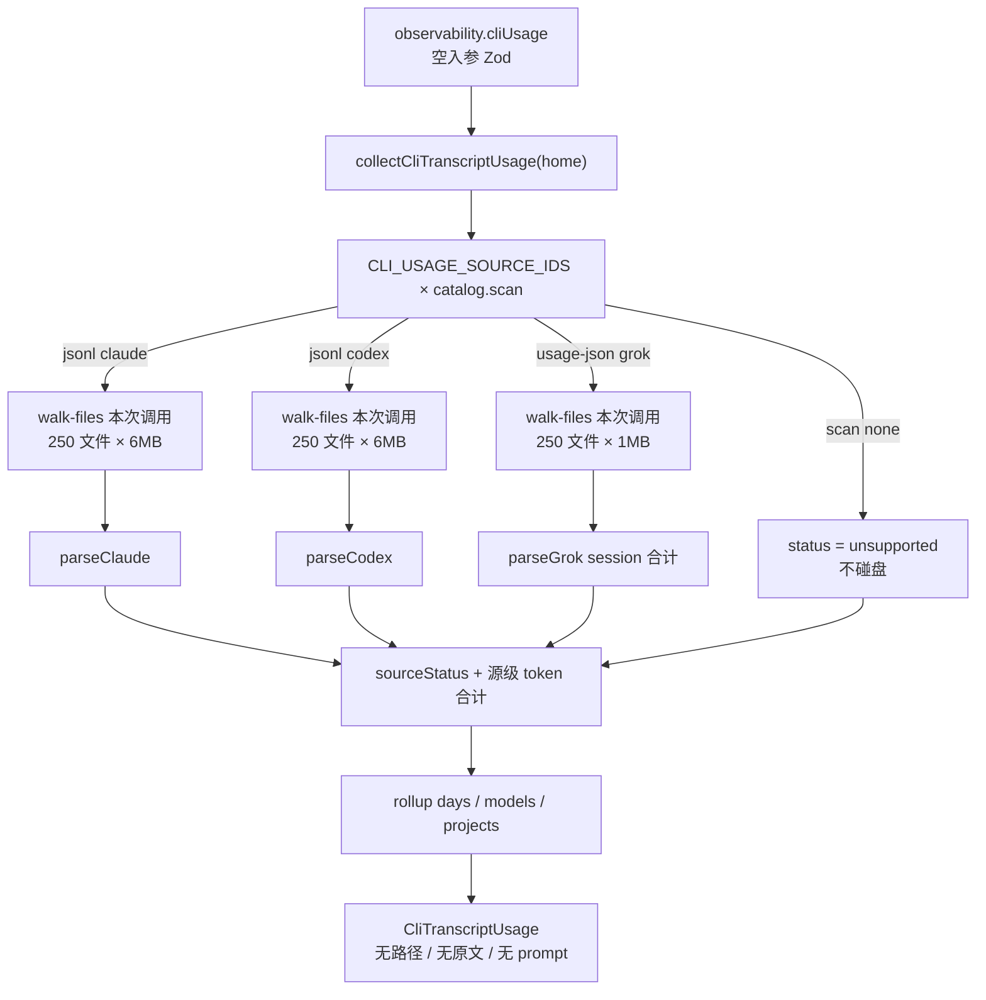
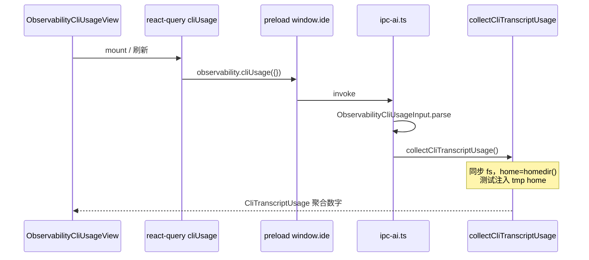

# 本机 CLI 用量记录（cliUsage）补齐执行计划

| 字段 | 值 |
|---|---|
| 作者 | TBD |
| 日期 | 2026-09-10 |
| 状态 | Implemented |
| 仓库 | enjoy-agnets |
| 关联 spec | `design/specs/m1-usage-and-capabilities.md` · `design/specs/observability.md` · `design/specs/ipc.md` |
| 范围 | `#/observability`「本机记录」视图；`observability.cliUsage` IPC；main `cli-transcript-usage` |

---

## Overview

`#/observability` 的「本机记录」今天只扫 Claude Code jsonl 与 Codex rollout jsonl。Enjoy 导轨已接线 12 个本机 CLI，但 IPC `CliUsageSourceId` 仍是 `"claude" | "codex"`，UI 只画两粒芯片。本机实证：Claude 目录不存在；Codex 19 份会话只有 `total_tokens`（拆分全 0、`model` 空、`model_provider="custom"`）；Grok `~/.grok/sessions/**/usage.json` 有 41 份官方合计，含输入/输出/缓存/模型/可选费用。用户截图（合计 1.1M、19 会话、拆分全 —、模型列 `custom`）与文件内容一致，不是 UI 吃掉数字。

本轮把来源列表与导轨 catalog 对齐（每个 CLI 都有可测试的四态），继续扫 Claude/Codex，新增 Grok `usage.json` adapter，修正 Codex 模型列，并在有官方 `costUsdTicks` 时单独展示「Grok 记录的费用」。不把本机记录画进 Composer `UsagePill`，不按模型 id 猜单价，不做日趋势图，不扫 Cursor transcript。`collectCliTranscriptUsage(home)` 仍是唯一外部接口；内部按 adapter 拆源，避免 `collect.ts` 变成上帝文件。

---

## Background & Motivation

### 当前实现

| 层 | 路径 | 现状 |
|---|---|---|
| IPC | `packages/ipc-contract/src/observability.ts` | `CliUsageSourceId = "claude" \| "codex"`；`CliUsageSource` 只有 `id / found / sessionCount` |
| 扫描 | `apps/desktop/src/main/services/cli-transcript-usage/` | `collect.ts` 硬编码两源；Claude 按行累加 `message.usage`；Codex 每文件只取最后一次 `token_count.total_token_usage` |
| IPC handle | `apps/desktop/src/main/ipc-ai.ts` `observability.cliUsage` | 空入参 Zod parse 后直接 `collectCliTranscriptUsage()` |
| UI | `observability/components/cli-usage/` | 两粒芯片；非 claude 一律当 Codex 名；拆分全 0 画 `—`（`hasTokenBreakdown`） |
| 词表 | `i18n/catalogs/{zh,en}/pages-observability.ts` | 只有 `cliUsageClaude` / `cliUsageCodex` |

导轨 catalog（`MATRIX_RUNTIME_IDS` / `BuiltinAgentToolId`）：

`enjoy-local` · `claude` · `cursor` · `grok` · `codex` · `antigravity` · `gemini` · `opencode` · `pi` · `hermes` · `amp` · `deepseek` · `omp` + `sandbox-harness`（不上轨）+ `custom-acp`。

L1 额度条 `quota===true` 仅 Cursor / Grok / Antigravity。Claude / Codex / Enjoy 本地 `quota=false`，禁止空条。本机 jsonl **不是 L1**。

### 对照物

- **Termany**：可启动 12 个 agent，用量页明确只读 Claude + Codex transcript，其它标 unsupported；另外画估算美元费用和日趋势图。来源态可学，**假账单和日趋势图不抄**。
- **Zeron**：驱动多家 CLI，但 PARITY.md §8 **Token-usage display dropped**（无 WatchUsage）。账号卡是 rate-limit 条。Zeron **不是**用量对照物。

### 本机实证（已读盘，不再猜）

| 源 | 路径 | 事实 |
|---|---|---|
| Codex | `~/.codex/sessions/**/rollout-*.jsonl` | 19 份。`token_count.info.total_token_usage` 里 `input_tokens/output_tokens/cached_input_tokens` 全是 0，只有 `total_tokens`。`session_meta.model` 为空，`model_provider` 为 `"custom"`。无拆分是自定义上游没写字段。 |
| Claude | `~/.claude/projects` | **不存在**。应走目录缺失空态，不是 0 填充。 |
| Grok | `~/.grok/sessions/**/usage.json` | 41 份。字段：`inputTokens` `outputTokens` `cachedReadTokens` `cacheCreationTokens` `reasoningTokens` `totalTokens` `primaryModelId` `costUsdTicks` `modelUsage`。官方写入，不是按模型 id 猜的单价。 |
| Cursor | `~/.cursor/projects/**/agent-transcripts/*.jsonl` | 有会话正文，**没有 usage 字段**。额度继续走 L1 `agentTools.inspect`。 |
| 其它 | `.gemini` 仅配置；无 `.opencode` / `.pi` / `.amp` | 本轮不扫。 |

`parse-codex.ts` 当前把 `model_provider` 回落成模型名：

```32:34:apps/desktop/src/main/services/cli-transcript-usage/parse-codex.ts
      acc.model =
        stringField(payload, "model") ?? stringField(payload, "model_provider") ?? acc.model
```

这就是截图模型列出现 `custom` 的直接原因。

### 痛点

1. 导轨有 12 家 CLI，用量页假装世界只有 Claude + Codex。
2. Grok 41 份官方 `usage.json` 完全没读。
3. Codex 自定义上游被显示成模型名 `custom`。
4. `found: boolean` 无法区分「目录不存在 / 扫了但无用量 / 本版本不扫描」。
5. `collect.ts` 把 roots、walk、parse、rollup 揉在一起；再加 Grok 会变成上帝文件。

---

## Goals & Non-Goals

### Goals

1. 来源列表与导轨 CLI catalog 对齐：每个可扫/不可扫的 CLI 都有四态之一。
2. 本轮必扫：Claude jsonl、Codex jsonl、Grok `usage.json`（session 级合计，不累加 `turns[]`）。
3. Codex 模型列：有 `model` 用模型；否则「自定义上游」或「未知」，**禁止**把 `model_provider` 当模型名。
4. Codex 拆分全 0 保持 `—`，不估输入/输出。用真实 custom provider 夹具锁测试。
5. 仅当可见源都有拆分时走四 KPI（例如 Grok-only）；与仅合计源混合时走合计卡（与 Grok 入表同 PR）。`costUsdTicks` 若展示，单独一卡，标明「Grok 记录的费用」，除以 \(10^{10}\)；`< $0.01` 四位否则两位。
6. renderer 只拿聚合数字。禁止 prompt、jsonl 原文、绝对路径进 renderer。
7. 测试：parser 用夹具；collect 用 tmp home；禁止读真实 `~`。
8. 分 PR，每 PR 可独立 review / 合并；Grok 入表不得早于混合 KPI/表改动合进主支。

### Non-Goals（本轮明确不做）

| 项 | 原因 |
|---|---|
| 日趋势图 | 下一档；按日表已有 |
| Cursor transcript 扫描 | 无 usage 字段；额度走 L1 |
| 改 L1 `UsagePill`（Cursor / Grok / Antigravity） | 本机记录不是 L1 |
| Gemini / OpenCode / Pi / Hermes / Amp / DeepSeek / OMP / Antigravity 扫描 | 只标「本版本不扫描」 |
| Enjoy Local 遥测并进本机记录 | 继续留在可观测性大盘 |
| 按模型 id 猜单价 / Termany $69.22 风格账单 | 禁止 |
| 侧栏 + 顶栏 tabs 双导航改造 | 范围外 |
| 读 Grok `updates.jsonl` / `turns[]` / spawn `grok usage` / `GROK_HOME` | 只读 `{home}/.grok/sessions/<group>/<id>/usage.json`；自定义 GROK_HOME 显示 directory-missing |
| 自定义 ACP 来源芯片 | 无稳定 transcript 路径；不进静态 catalog |

---

## Proposed Design

### 1. 分层与模块 seam

`collectCliTranscriptUsage(home = homedir(), now = Date.now())` **仍是唯一外部接口**（`ipc-ai.ts` 与 `index.ts` 不改签名）。内部按 adapter 扫源。

#### 文件拆分（目标树）

PR1 就把编排层从 `collect.ts` 拆出，避免「先堆 collect、PR3 再变薄」。`parse-*` 进 `parsers/`，避免根目录与 `adapters/` 双平铺。

```
apps/desktop/src/main/services/cli-transcript-usage/
  index.ts
  constants.ts             # 扫描上限；ticks 常量从 ipc-contract re-export
  catalog.ts               # 每源 scan 模式与 roots(home)；不进 renderer
  source-status.ts         # 四态纯函数，单测不碰盘
  walk-files.ts            # 带「每次调用」文件/字节上限的列举
  rollup.ts                # 日 / 模型 / 项目桶（PR1 保持现字段；PR3 加 breakdown）
  collect.ts               # 编排：catalog × adapter → CliTranscriptUsage
  parsers/
    parse-usage.ts         # intField / asRecord / cwd / day（已有，迁入）
    parse-claude.ts
    parse-codex.ts
    parse-grok.ts          # PR3 新增
  adapters/
    types.ts
    claude.ts              # PR1：jsonl adapter 壳
    codex.ts
    grok.ts                # PR3 新增
  collect.test.ts
  source-status.test.ts
  parsers/parse-codex.test.ts
  parsers/parse-grok.test.ts   # PR3
```

Renderer（根目录只留 view；组件进 `components/`，纯函数进 `lib/`）：

```
observability/components/cli-usage/
  observability-cli-usage-view.tsx
  components/
    source-chips.tsx       # PR1 必交：12 粒状态芯片
    kpis.tsx               # 已有，迁入
    table.tsx              # 已有，迁入
    cost-card.tsx          # PR4 新增
  lib/
    format.ts
    format.test.ts
    source-chip-copy.ts    # id → i18n 查表，禁止 claude?…:Codex
```

职责一句话：

| 文件 | 职责 |
|---|---|
| `catalog.ts` | 声明谁扫、扫什么、根目录在哪；unsupported 源 `scan: "none"`，**不碰盘** |
| `source-status.ts` | `(scan, directoryFound, fileCount, sessionCount) → status` |
| `walk-files.ts` | **每次调用独立计数**的 walk；把相对 `root` 的路径交给 adapter 谓词；jsonl 源之间、与 Grok 互不占用配额 |
| `adapters/*.ts` | 单源：roots + matchRelPath + parse |
| `parsers/parse-grok.ts` | 一份 `usage.json` → 显式 `UsageDelta`，忽略 `turns[]` |
| `collect.ts` | 循环 catalog，合并 deltas，填齐所有源的 status 行 |
| `rollup.ts` | 纯聚合 |

`collect.ts` 目标 <150 行。禁止在 collect 里再写 Grok 路径字符串或 jsonl 特例。PR1 验收：抽出后 `collect.ts` 仍低于 150 行。

#### Adapter 接口

```ts
/** 单源扫描器。unsupported 源不实现 adapter，catalog.scan === "none" 即可。 */
export type CliUsageAdapter = {
  id: CliUsageSourceId
  roots: (home: string) => string[]
  /**
   * 相对 **该 adapter 的 root** 的路径（`/` 分隔），不是 basename。
   * walk 只把谓词为 true 的文件计入 out / fileCount / 上限。
   * basename-only 无法表达「恰好三层」或忽略 `subagents/`。
   */
  matchRelPath: (relPath: string) => boolean
  /**
   * ctx.filePath 只给 adapter 推 project 名（Grok encoded cwd）。
   * 禁止把 filePath / root 写进返回值任何字段。
   */
  parse: (text: string, ctx: { filePath: string; root: string }) => UsageDelta | null
}
```

Grok `matchRelPath`（相对 `{home}/.grok/sessions`）写死：

```ts
export function matchGrokUsageRelPath(relPath: string): boolean {
  const parts = relPath.replaceAll("\\", "/").split("/").filter(Boolean)
  if (parts.some((part) => part === "subagents")) return false
  return parts.length === 3 && parts[2] === "usage.json"
}
```

Claude / Codex：`relPath` 最后一段 `.endsWith(".jsonl")` 即可（任意深度，与现状一致）。`fileCount` = 该次 walk 中 `matchRelPath === true` 的文件数。嵌套 Grok `usage.json` 谓词为 false → **不当成扫到的文件**，不会把源标成「有文件无用量」。collect 不写 Grok 路径特例。

`UsageDelta` 扩展（main 内部，不进 IPC）。Grok **显式构造**该对象，禁止 `...json` / `...parsed`，以免把路径或 `turns` 漏进 rollup。

```ts
export type UsageDelta = {
  inputTokens: number
  outputTokens: number
  cacheTokens: number
  totalTokens: number
  model?: string
  day?: string
  project?: string
  sourceId: CliUsageSourceId
  /** 上游写入的费用 ticks；仅 Grok。缺省或 ≤0 视为未记录。 */
  costUsdTicks?: number
}
```

`parse-grok.ts` 只用 `asRecord` / `stringField` / `projectLabelFromCwd` / `dayKeyFromTimestamp` / `intField`（拆分字段，缺省当 0）以及 **`optionalIntField`**（见下）。**禁止**调用 `usageFromTokenFields` 和 `addUsage`。扩展 `UsageDelta` 时若 Claude/Codex 仍走 `addUsage`，必须同步抄新可选字段，或让它们继续只用旧四元组。

`intField` 在键缺失时返回 `0`，**不能**用来读 `totalTokens`：缺字段会被当成合计 0，夹具「缺 `totalTokens` → 7210+1893+41000」会失败。放在 `parsers/parse-usage.ts`：

```ts
/** 键缺失、非有限数、负数 → undefined。显式 0 → 0。 */
export function optionalIntField(
  record: Record<string, unknown> | null,
  key: string
): number | undefined {
  if (!record || !(key in record)) return undefined
  const value = record[key]
  if (typeof value !== "number" || !Number.isFinite(value) || value < 0) return undefined
  return Math.floor(value)
}
```

### 2. 来源 catalog 与四态

本机记录的静态来源 **不等于** `MATRIX_RUNTIME_IDS` 全表：

| ID | 是否进 cliUsage catalog | 本轮 scan | 理由 |
|---|---|---|---|
| `claude` `codex` | 是 | jsonl | 已有 |
| `grok` | 是 | usage-json | 本轮必做 |
| `cursor` `antigravity` `gemini` `opencode` `pi` `hermes` `amp` `deepseek` `omp` | 是 | **none** | 芯片标「本版本不扫描」 |
| `enjoy-local` | **否** | — | 遥测留在大盘 |
| `sandbox-harness` | **否** | — | 不上导轨 |
| `custom-acp` / `custom:*` | **否** | — | 无稳定路径 |

契约导出顺序与导轨 CLI 段一致，便于芯片稳定排列：

```ts
export const CLI_USAGE_SOURCE_IDS = [
  "claude", "cursor", "grok", "codex", "antigravity",
  "gemini", "opencode", "pi", "hermes", "amp", "deepseek", "omp"
] as const
```

#### 四态（`found` 退役）

```ts
export const CliUsageSourceStatus = z.enum([
  "has-usage",          // 已扫描且至少 1 份有用量
  "directory-missing",  // 预期根目录都不存在
  "scanned-empty",      // 目录在，但 0 份有用量（无文件，或有文件无 usage 字段）
  "unsupported"         // 本版本不扫描，即使磁盘上有东西也不读
])
```

推导（`source-status.ts`，必须单测）：

```
scan === "none"                         → unsupported
!directoryFound                         → directory-missing
sessionCount > 0                        → has-usage
directoryFound && sessionCount === 0    → scanned-empty
```

`scanned-empty` 用 `fileCount` 区分文案：

- `fileCount === 0`：目录在，没有目标文件
- `fileCount > 0`：有会话文件但没有用量字段（Claude/Codex 空 jsonl；**不是** Cursor——Cursor 本轮是 `unsupported`，不读盘）

`unsupported` **禁止** `existsSync`。不要因为本机有 `~/.gemini` 就把 Gemini 画成「未找到」或 0 会话。

#### 空态规则

- 页面级空态：所有源 `status !== "has-usage"` 时才进入 EmptyCopy。芯片仍全列（12 粒），空态文案在芯片上方。
- 空态 copy（PR1 必须落地，不能沿用 `sources.some(found)`）：
  - 存在任一 `scanned-empty` → 现有 `cliUsageNoTokens`（「找到了记录目录，但里面没有用量字段。」）
  - 否则（只剩 `directory-missing` + `unsupported`）→ **新键** `cliUsageEmpty`：「本机没有可读的 CLI 记录。」（不再写「Claude 或 Codex」）。10 个恒 `unsupported` 不得把页面推进 `cliUsageNoTokens`。
- 若有任一 `has-usage`（本机实证：Grok 41 份），画 KPI + 芯片 + 表，即使 Claude `directory-missing`、Codex 只有合计。
- 目录不存在 **不是** 0 填充条。KPI 不出现假 0 拆分（沿用 `hasTokenBreakdown`）。
- PR1 的 `collectSource` **必须**返回 `fileCount` = walk 到的目标文件数（含用量为 0 的 jsonl）。芯片 `scanned-empty` 文案依赖它：`fileCount > 0` → 「无用量字段」；`fileCount === 0` → 「目录为空」。

### 3. 扫描编排



主进程 **同步读盘**（与现状一致）。现状 `collect.ts` 已是 **每源** `listJsonl(...).slice(0, 250)`（Claude 与 Codex 各 250）。本设计保持该语义，**不是** Claude+Codex 共享 250。renderer 不得扫盘。

上限 **per adapter 调用**（`walk-files.ts` 每次调用自带计数器，禁止模块级全局累加）：

```ts
export const MAX_TRANSCRIPT_FILES = 250      // 每个 jsonl adapter 各 250
export const MAX_TRANSCRIPT_BYTES = 6 * 1024 * 1024
export const MAX_PROJECT_BUCKETS = 12
export const MAX_USAGE_JSON_FILES = 250      // Grok 自己的 250，不占用 jsonl 配额
export const MAX_USAGE_JSON_BYTES = 1 * 1024 * 1024
```

即：Claude 250×6MB + Codex 250×6MB + Grok 250×1MB，互不占用。`walk-files.ts` 在 **本次** `out.length >= cap` 时停止。超限静默截断，不抛到 UI；不在 IPC 里回传「截断了哪些路径」。

有用量才进 deltas（与现逻辑一致）：

```
totalTokens + inputTokens + outputTokens + cacheTokens > 0
```

Codex 只有 `total_tokens` 的会话 **会计入**（这就是截图 19 会话 / 1.1M 的来源）。全 0 的文件计 `fileCount` 但不计 `sessionCount`。

### 4. Grok adapter

#### 路径

```
{home}/.grok/sessions/<encoded-cwd>/<session-id>/usage.json
```

官方布局（grok-build `17-sessions.md`）：cwd 做 URL-encoding；超过 255 字节时改用 slug+hash，并在 group 目录写 `.cwd`。`USAGE_FILE = "usage.json"`；文件不存在时 `SessionUsageFile::load_for_session` 返回 `NoUsage`——**不是每个会话目录都有该文件**。用户指南目录树甚至不列 `usage.json`。本轮产品取舍：只读磁盘上已有的 `usage.json`，不 spawn `grok usage`，不读 `updates.jsonl`（含 prompt/工具）。无该文件的会话 = 「无用量字段」，不是去补扫。

Walk 规则写死（由 **`matchGrokUsageRelPath`** 执行，不是 `parse` 返回 null，也不是 collect 里的硬编码）：

1. **只接受**相对 `sessions/` 恰好三层的路径：`<group>/<session-id>/usage.json`。
2. 路径任一段为 `subagents` 或更深 → 谓词 false，**不计入 `fileCount` / `sessionCount` / 250 上限**。父 session 合计若已 fold 子 agent，避免再加一遍。
3. 正常 sessions 树里的 sibling 子会话（独立 `<session-id>/usage.json`）按独立会话计数，与 Codex 每份 jsonl 一行相同。若日后证实 parent 合计已含 child，再加「有 parent 则跳过」——本轮不读 `summary.json`（标题隐私）。残留双计风险见 Risks。
4. `fileCount` = `matchRelPath === true` 的文件数（含全 0）。会话目录存在但没有 `usage.json` → walk 看不见它们，表现为 `directoryFound && fileCount===0` → `scanned-empty`。本轮接受，不枚举空会话目录。

项目名：

1. 对 `<group>`（encoded-cwd）做 `decodeURIComponent`，成功则走 `projectLabelFromCwd`（只留最后一段）。**单段 slug+hash 是合法项目名**（cwd 超 255 字节时官方就用它）；禁止把「decode 后没有 `/`」当成失败。
2. **`decodeURIComponent` 抛错**，或 decode 结果仍含 `%2F` / `%2f` / `%5C`（双重编码或未完全解码）→ 省略 `project`，token 仍入桶。不要把未 decode 的 `%2FUsers%2F…` 当 key。
3. 同组若存在 `.cwd`：最多读 **4KB**；只取第一行文本当 cwd，同样只留最后一段。超 4KB、读失败、空行 → 回落步骤 1–2，不把文件内容送进 IPC。
4. 不读 `updates.jsonl` / `chat_history.jsonl` / `summary.json` / `signals.json`。

#### 解析（禁止把 turns 再加一遍）

磁盘上的 `usage.json` 即 grok-build `SessionUsageFile` 的 JSON（`grok usage <id>` 无 turn 参数时的同一形状）：

```json
{
  "sessionId": "…",
  "updatedAt": "2026-09-08T06:32:11.040Z",
  "session": {
    "inputTokens": 7210,
    "outputTokens": 1893,
    "cachedReadTokens": 41000,
    "cacheCreationTokens": 0,
    "reasoningTokens": 412,
    "totalTokens": 50103,
    "primaryModelId": "grok-4.6",
    "costUsdTicks": 126890500,
    "modelUsage": { "grok-4.6": { } }
  },
  "turns": [ ]
}
```

本机实证字段名与此一致。样本算术：`7210 + 1893 + 41000 = 50103`，即这份官方 `totalTokens` **含 cache**。同份样本 `inputTokens (7210) < cachedReadTokens (41000)`，**不能**假设 input 已含 cache（ccusage 的「input 含 cache」与此样本不符）。Parser **以文件内字段为准，不发明口径**。

| 输出 | 规则 |
|---|---|
| token 来源 | **只读 `session` 对象**。存在 `turns` 也忽略。若文件把合计写在顶层（无 `session` 包一层），允许顶层同名字段，仍不扫 `turns`。 |
| `inputTokens` | `session.inputTokens` 原样。不做 ccusage 式 `input − cache` 相减。 |
| `outputTokens` | `session.outputTokens` 原样。**不**把 `reasoningTokens` 再加一遍（官方与 ccusage 均说明 reasoning 已含在 output）。 |
| `cacheTokens` | `cachedReadTokens + cacheCreationTokens` |
| `totalTokens` | `optionalIntField(..., "totalTokens")`：`undefined`（键缺失 / 非有限 / 负）才回落 `input+output+cache`。**显式 `0` 就是 0**，不得当成缺省。禁止 `intField === 0` 当缺字段。四者之和仍为 0 则该文件不计 session。 |
| `model` | `primaryModelId`；空则 undefined → 模型列「未知」 |
| `day` | `updatedAt` 或顶层 ISO 时间戳的 `YYYY-MM-DD` 前缀（与 Claude/Codex 一样吃 UTC 日期，不转本地时区） |
| `project` | 见上；decode / `.cwd` 失败则省略，token 仍入桶 |
| `costUsdTicks` | `session.costUsdTicks` 为有限整数且 **> 0** 才写入 delta。`0` / 缺失 = 未记录。collect 汇总时 ≤0 **omit** 该字段，Zod 虽允许 0 但载荷里不出现。 |

`modelUsage` 本轮不拆成多行模型桶：模型列用 `primaryModelId` 一行。多模型会话的细分是下一档。

夹具至少覆盖：

1. 标准 `session` + 非空 `turns`（断言 token **不等于** turns 之和，防止回归累加）。
2. 无 `session`、字段在顶层。
3. **缺 `totalTokens` 键**：`input=7210, output=1893, cachedRead=41000` → `totalTokens === 50103`（`optionalIntField` → undefined → 回落）。
4. **显式 `totalTokens: 0`** 且 in/out/cache 均为 0 → 不计 session；不得回落成把 cache 加进去。
5. `costUsdTicks` 缺失 / 0 / 正数（0 与缺失均不出现在 source 上；可用 `intField` 或 `optionalIntField`，≤0 omit）。
6. URL-encoded cwd：`%2FUsers%2F…`、`%2fusers%2f…`（大小写）、Linux `/home/` 编码、Windows `\\Users\\` / `%5CUsers%5C` → 只产出最后一段；blob 不含这些前缀，也 **不含未 decode 的编码串**。单段 slug（无 `/`）decode 成功则 **保留** 为 project。
7. `.cwd` 优先；`.cwd` >4KB 或损坏 → 省略 project，token 仍在。
8. 嵌套路径 **不在 `parse-grok` 测**：`matchGrokUsageRelPath("g/id/subagents/x/usage.json") === false`；`collect` 夹具里该文件不增加 `fileCount` / `sessionCount`。

### 5. Codex 模型列

`parse-codex.ts` 的 `session_meta` 改为：

```ts
if (row.type === "session_meta" && payload) {
  acc.project = projectLabelFromCwd(stringField(payload, "cwd")) ?? acc.project
  const model = stringField(payload, "model")
  if (model) {
    acc.model = model
  } else if (stringField(payload, "model_provider") === "custom") {
    acc.model = CUSTOM_UPSTREAM_MODEL_KEY // "custom-upstream"
  }
  // 其它 provider 且无 model：留下 undefined → 未知
}
```

- **禁止** `model ?? model_provider`。
- 稳定 sentinel `"custom-upstream"` 进 IPC 的 `models[].key`；renderer 翻词表，main **不**写中文。
- 拆分全 0：现有 `hasTokenBreakdown` 已返回 false，表列画 `—`。PR2 用与本机 19 份同构的夹具锁住：`totalTokens > 0` 且 in/out/cache 均为 0。

### 6. 混合来源的拆分展示

Grok 有拆分，Codex 常常只有合计。若直接 `sumBuckets(days)` 再 `hasTokenBreakdown`，会出现「合计含 Codex 的 1.1M，输入却只有 Grok 的拆分」——占比会骗人。

规则（**与 Grok 入表同 PR 落地，见 PR3；不得等 PR4**。当前 UI 正是 `sumBuckets(days)` + `hasTokenBreakdown`，PR3 若只把 Grok deltas 推进同一张表，本机 Codex 19 + Grok 41 会默认走四卡，占比必假）：

1. 每个 `CliUsageSource` 带自己的 token 合计（PR1 已有）。KPI 按「当前可见源」汇总：默认全部 `has-usage`。
2. **可见源里同时存在「有拆分」和「仅合计」** → KPI 走 `TotalKpiRow`（合计 + 会话），不走四卡。仅当可见源全都有拆分（例如以后过滤到只剩 Grok）才四卡。
3. 表行：PR3 起桶上有 `breakdownSessions`。该行 `breakdownSessions === sessions` 且拆分 > 0 才画数字，否则拆分列 `—`，合计列仍画 `totalTokens`。
4. 芯片在 PR1 是 **只读状态指示器**（12 粒，查表命名）。点击过滤是 PR4 **非阻塞**增强（client-side，依赖 `sourceIds`）。`unsupported` / `directory-missing` 不可当过滤器。

这比「同一张表硬混拆分」诚实，也不做按日图。

### 7. Grok 费用（写死换算，不猜）

#### 单位（已核实，不是猜测）

| 来源 | 陈述 |
|---|---|
| xAI Cost Tracking 文档 | 1 USD = 10,000,000,000 ticks（\(10^{10}\)）；`cost_usd = cost_in_usd_ticks / 10_000_000_000`；例 `37756000` ticks = $0.0038 |
| grok-build `17-sessions.md` `grok usage` | 「`costUsdTicks` is \(10^{10}\) ticks per USD (divide by `1e10` for dollars)」 |
| grok-build `UsageTotals` | `/// USD ticks (1e10 per USD). Absent when no call reported cost.` |
| ccusage Grok adapter | 「one tick is 1e-10 USD」 |

常量写入 **ipc-contract**（main / renderer 共用，禁止两边各写一个魔法数）。**换算与格式化只放 renderer** `cli-usage/lib/format.ts`：main 不需要美元字符串。

```ts
/** 1 USD = 10^10 ticks。Grok / xAI 官方口径。 */
export const GROK_USD_TICKS_PER_DOLLAR = 10_000_000_000
```

```ts
export function grokTicksToUsd(ticks: number): number {
  if (!Number.isFinite(ticks) || ticks <= 0) return 0
  return ticks / GROK_USD_TICKS_PER_DOLLAR
}

/** < $0.01 → 4 位（$0.0038）；否则 2 位（$1.00）。 */
export function formatGrokUsd(ticks: number): string {
  const usd = grokTicksToUsd(ticks)
  if (usd <= 0) return ""
  return usd < 0.01 ? `$${usd.toFixed(4)}` : `$${usd.toFixed(2)}`
}
```

IPC **只传整数 ticks**。collect：源级合计 `ticks <= 0` 时 **omit** `costUsdTicks`（不要显式 `0`）。Zod 字段仍是 `.optional()`，允许缺省，实现不得输出 0。

#### 展示

- 仅当可见 Grok 源的 `costUsdTicks` 合计 > 0 时出现 **单独费用卡**（不塞进 token 四卡，不进日/模型/项目表的 token 列）。PR4 才做这张卡。
- 文案：「Grok 记录的费用」+ `formatGrokUsd`。hint：「来自 usage.json 的 costUsdTicks，不是 Enjoy 账单」。
- 缺失 / omit：**整卡不渲染**，不要 $0.00 假装免费。OAuth/池额度路径经常不打 ticks（grok-build 文档：cost 主要打在 API-key 流量上）。
- 禁止用 ticks 反推「官方定价表」或补全其它 CLI 的费用列。

#### 残留风险

若未来 grok-build 改 ticks 标度，费用卡会错一个数量级。缓解：常量旁注释三处官方出处；单测 `grokTicksToUsd(10_000_000_000) === 1`、`grokTicksToUsd(37_756_000) === 0.0037756`、`formatGrokUsd(37_756_000) === "$0.0038"`、`formatGrokUsd(10_000_000_000) === "$1.00"`。本轮 **不**再做运行时探测步骤——单位已从文档钉死。grok-build `UsageTotals` 源码注释本次 review 未能打开核对，但不影响三处公开文档的一致结论。

### 8. UI

已有拆分：`cli-usage/`。目录见 §1（`components/` + `lib/`）。**12 粒状态芯片是 PR1 合并门禁**，不是 PR4 的「来源列表」工作。`CliUsageSourceId` 扩成 12 元后，现有

```
source.id === "claude" ? t("…cliUsageClaude") : t("…cliUsageCodex")
```

**仍然类型合法**：非 claude 一律走 Codex。删 `found` 会逼改空态，但不会逼改这行。必须查表：

```ts
const SOURCE_NAME_KEY: Record<CliUsageSourceId, string> = {
  claude: "pages.observability.cliUsageSource.claude",
  cursor: "pages.observability.cliUsageSource.cursor",
  grok: "pages.observability.cliUsageSource.grok",
  // … catalog 全员，禁止 fallback 到 Codex
}
```

PR1 加一条会失败的测试（renderer 纯函数或 snapshot）：`sourceChipLabel({ id: "grok", status: "unsupported", … })` 不得包含 Codex 词条 / `cliUsageCodex`。

视觉：BoardUI 语义 token（`border-separator-border` / `text-text-*` / `bg-background-*`），与现芯片一致。

| status | 芯片 |
|---|---|
| `has-usage` | 实线；`{name} · {n} 份会话` |
| `directory-missing` | 虚线；`{name} · 未找到记录` |
| `scanned-empty` | 虚线；`fileCount>0` → `{name} · 无用量字段`，否则 `{name} · 目录为空` |
| `unsupported` | 更弱的 tertiary；`{name} · 本版本不扫描` |

芯片按 `CLI_USAGE_SOURCE_IDS` 全列。过滤点击是 PR4 非阻塞项：`has-usage` 芯片切换 `selectedSourceId`；再点一次回到全部。KPI / 表 / 费用卡跟过滤走。不实现过滤也不阻塞 PR4 合并。

### 9. 性能与隐私

- 扫描只在 main，同步 fs。预期：19 份 Codex jsonl + 41 份小 json ≪ 250×6MB 上限。
- 延迟目标：与现状同量级（本机 SSD 上百毫秒级）。不在 renderer 加 loading 以上的新骨架也可接受；刷新按钮已有。
- IPC 载荷：聚合桶 + 12 条 source 行。禁止路径、原文、session id、prompt。
- `JSON.stringify(report)` 测试断言（大小写不敏感）不含：`/Users/`、`/home/`、`\\Users\\`、`%2FUsers`、`%2fusers`、`%2Fhome`、`%5CUsers`。未 decode 的编码串不得出现在 blob。`UsageDelta` 与 report 不得含 `filePath`。

### 10. 测试策略

| 层 | 必须 |
|---|---|
| `source-status.test.ts` | 四态真值表，含 `scan:"none"` 即使 `directoryFound=true` 仍是 unsupported |
| `parse-claude` | 现有按行累加；保留 |
| `parse-codex` | 最后一次 `token_count`；**新增** custom provider 夹具：model 空、provider `custom`、拆分全 0、`total_tokens>0` |
| `parse-grok` | session 合计 vs turns 累加；**缺键**回落含 cache；**显式 0** 不回落；ticks 0 omit；cwd decode；顶层字段回落 |
| `matchGrokUsageRelPath` | 三层 `usage.json` true；含 `subagents` 或更深 false |
| `collect.test.ts` | **只** `mkdtempSync`，禁止 `homedir()`。覆盖：三源混合、Claude 目录缺失、Grok-only、unsupported 源 0 次 `existsSync`、每源 250 上限互不占用、**嵌套 usage.json 不增加 fileCount** |
| renderer `lib/format.test.ts` | 拆分全 0；混合源 KPI；ticks 换算与 `$0.0038` / `$1.00` |
| renderer `source-chip-copy` | `id: "grok"` 不得命中 `cliUsageCodex` |
| ipc-contract | PR1 schema 圆trip；旧 `{found:true}` **应失败** |

夹具放测试文件内的字符串即可，不必建真实 `~/.grok`。

---

## API / Interface Changes

频道名、入参不变：`observability.cliUsage` + `ObservabilityCliUsageInput = z.object({}).strict()`。preload 无需改签名。破坏性变更仅在 **返回值**（同仓 renderer 必须同 PR 或 PR1 内一起改）。

### Before

```ts
export const CliUsageSourceId = z.enum(["claude", "codex"])

export const CliUsageSource = z.object({
  id: CliUsageSourceId,
  found: z.boolean(),
  sessionCount: z.number().int().nonnegative()
})

export const CliUsageBucket = z.object({
  key: z.string(),
  inputTokens: z.number().int().nonnegative(),
  outputTokens: z.number().int().nonnegative(),
  cacheTokens: z.number().int().nonnegative(),
  totalTokens: z.number().int().nonnegative(),
  sessions: z.number().int().nonnegative()
})

export const CliTranscriptUsage = z.object({
  scannedAt: z.number().int(),
  sources: z.array(CliUsageSource),
  days: z.array(CliUsageBucket),
  models: z.array(CliUsageBucket),
  projects: z.array(CliUsageBucket)
})
```

禁止「一份终态 After、三份 PR 各做一部分」。下面两份 schema 才是可合入的类型。`sumBuckets` / `EMPTY_BUCKET` 必须与 **当时** 的 `CliUsageBucket` 对齐。

#### PR1 schema（本 PR 合入即生效）

```ts
export const CLI_USAGE_SOURCE_IDS = [
  "claude", "cursor", "grok", "codex", "antigravity",
  "gemini", "opencode", "pi", "hermes", "amp", "deepseek", "omp"
] as const

export const CliUsageSourceId = z.enum(CLI_USAGE_SOURCE_IDS)
export type CliUsageSourceId = z.infer<typeof CliUsageSourceId>

export const CliUsageSourceStatus = z.enum([
  "has-usage",
  "directory-missing",
  "scanned-empty",
  "unsupported"
])
export type CliUsageSourceStatus = z.infer<typeof CliUsageSourceStatus>

/** 1 USD = 10^10 ticks。PR1 导出常量；换算函数在 renderer，PR4 才用。 */
export const GROK_USD_TICKS_PER_DOLLAR = 10_000_000_000

export const CliUsageSource = z.object({
  id: CliUsageSourceId,
  status: CliUsageSourceStatus,
  sessionCount: z.number().int().nonnegative(),
  /** walk 到的目标文件数（含用量为 0）。unsupported 恒 0。 */
  fileCount: z.number().int().nonnegative(),
  /** PR1 即从现成 deltas 求和，供芯片/空态/日后过滤。unsupported 全 0。 */
  inputTokens: z.number().int().nonnegative(),
  outputTokens: z.number().int().nonnegative(),
  cacheTokens: z.number().int().nonnegative(),
  totalTokens: z.number().int().nonnegative(),
  /** PR1 不写此字段。PR3 起 Grok 合计 >0 才出现；≤0 省略。 */
  costUsdTicks: z.number().int().positive().optional()
})

/** PR1：桶形状与现状相同。不要在 PR1 加 breakdownSessions / sourceIds。 */
export const CliUsageBucket = z.object({
  key: z.string(),
  inputTokens: z.number().int().nonnegative(),
  outputTokens: z.number().int().nonnegative(),
  cacheTokens: z.number().int().nonnegative(),
  totalTokens: z.number().int().nonnegative(),
  sessions: z.number().int().nonnegative()
})

export const CliTranscriptUsage = z.object({
  scannedAt: z.number().int(),
  sources: z.array(CliUsageSource), // 长度 === 12，顺序 = CLI_USAGE_SOURCE_IDS
  days: z.array(CliUsageBucket),
  models: z.array(CliUsageBucket),
  projects: z.array(CliUsageBucket)
})
```

`found` 删除，不保留兼容别名。`costUsdTicks` 用 `.positive().optional()`，从类型上禁止显式 `0`。

#### PR3 schema diff（在 PR1 之上）

`CliUsageBucket` **新增必填**：

```ts
export const CliUsageBucket = z.object({
  key: z.string(),
  inputTokens: z.number().int().nonnegative(),
  outputTokens: z.number().int().nonnegative(),
  cacheTokens: z.number().int().nonnegative(),
  totalTokens: z.number().int().nonnegative(),
  sessions: z.number().int().nonnegative(),
  /** 该桶内有拆分字段的会话数；用于决定画数字还是 — */
  breakdownSessions: z.number().int().nonnegative(),
  sourceIds: z.array(CliUsageSourceId)
})
```

rollup：会话 `input+output+cache > 0` 则 `breakdownSessions + 1`。`sourceIds` 为出现过的源去重，按 catalog 顺序排序。同 PR 更新 `EMPTY_BUCKET`、`sumBuckets`、表行 `—` 规则、混合 KPI。Grok 源在合计 ticks>0 时写入 `costUsdTicks`。

PR4 **不再改 Zod**。

### 调用链（不变的部分）



---

## Data Model Changes

无 SQLite / 无迁移。本机记录是 **读盘即时聚合**，不落库。

不写 `metrics` 表，不进 `observability.export` JSON/CSV（现 spec：导出仍只含 Enjoy 遥测）。本轮不改导出范围。

---

## Alternatives Considered

### A. 继续只扫 Claude+Codex，文案改成「暂不支持其它」

只改 hint。实现量最小，但与导轨 12 家 CLI 的产品承诺相反，Grok 41 份官方文件继续隐形。**否决**：来源列表必须 catalog 对齐。

### B. 抄 Termany：按模型 id 估美元 + 日趋势图

用户能立刻看到 $ 数字。违反 m1 不变量「禁止按模型 id 猜单价做成账单」；Codex custom 上游没有官方价；Grok 已有 `costUsdTicks` 时估价是重复且可能打架。日趋势图已定为下一档。**否决**。

### C. 每源一张表，不做全局 rollup

来源绝对可区分，无混合拆分问题。12 源（多数 unsupported）会把页面拉得很长；有用量的往往只有 1–2 家。**不采用**。改用：一张表 + 源芯片过滤 + 行级 `sourceIds` / `breakdownSessions`。

### D. 把 Grok 并进现有 `parse-usage.ts` 的 snake_case 抽取

少一个 parser。Grok 是 camelCase session JSON，不是 jsonl；强行共用容易把 `turns[]` 误加或把 `input_tokens` 与 `inputTokens` 搅在一起。**不采用**。共用只留 `intField` / `optionalIntField` / `projectLabelFromCwd` / `dayKeyFromTimestamp`。

### E. PR1 就把 Grok 标成可扫（只检查目录是否存在，不 parse）

芯片能显示「未找到 / 目录为空」，但会在 parse 落地前对 `~/.grok` 碰盘，且 status 语义与 PR3 不完全兼容（有 usage.json 却 `scanned-empty`）。**不采用**。PR1 对未接线源一律 `unsupported` 且不碰盘；PR3 把 grok 的 `scan` 改为 `usage-json`。

### F. 读 `updates.jsonl` 或 spawn `grok usage` 补无文件会话

ccusage 主源是 `updates.jsonl`（`turn_completed`），完备性更高；`grok usage` 是官方推荐入口。两者都会把 prompt/工具或子进程带进 main。无 `usage.json` 的会话本轮接受空态。**否决**：隐私不变量优先于完备性。

---

## Security & Privacy Considerations

| 威胁 | 严重度 | 缓解 |
|---|---|---|
| 绝对路径 / URL-encoded home 进 renderer | 高 | `decodeURIComponent` 抛错或结果仍含 `%2F`/`%2f`/`%5C` 则省略 project；单段 slug 保留；`.cwd` ≤4KB；显式构造 UsageDelta；测试禁 `/Users/` `/home/` `\\Users\\` `%2FUsers` `%2fusers` 及未 decode 串 |
| jsonl / usage.json 原文含 prompt、工具参数 | 高 | 只 parse 数字字段；IPC 类型无字符串正文 |
| 在 renderer 扫 `~` | 高 | 禁止；仅 main `collectCliTranscriptUsage` |
| 把本机 token 画进 Composer UsagePill，造成「额度」错觉 | 中 | m1 不变量；本轮不改 `usage/` |
| 把 Grok ticks 当成 Enjoy 账单 / 可点升级 | 中 | 独立卡 + 来源文案；无 CTA |
| `unsupported` 源误读 Cursor transcript（含代码） | 中 | catalog `scan:"none"` 不 walk |
| 超大 jsonl 拖死主进程 | 中 | 已有 6MB / 250 文件上限；Grok 另加 1MB / 250 |

不涉及 auth。不读 `~/.grok/auth.json`、不读各家 token。

---

## Observability

本功能自己就是只读观测，不打新遥测事件（避免把「扫了哪些路径」写进 metrics）。

- 失败：单文件 `stat/read/JSON.parse` 失败 → skip，不 fail 整次 IPC。
- 不新增 OTEL span。
- 若未来需要主进程日志：只记 `sourceId + fileCount + sessionCount + elapsedMs`，禁止文件路径。本轮可不打 log。
- 刷新：现有顶栏按钮已 `invalidateQueries(["cliUsage"])`。

---

## Rollout Plan

无 feature flag。内部 IPC，桌面应用随版本发布。

1. PR1 合并后：芯片变 12 粒且命名查表；Grok 暂时「本版本不扫描」（已知过渡态，PR3 消除）。
2. PR2：Codex 模型列修正，可单独进稳定版。
3. PR3：Grok 数字入表 **且** 混合 KPI / 表行 `—` 同时生效。不得在缺 UI 诚实性时把 PR3 合进主支。
4. PR4：Grok 费用卡 + 可选过滤。
5. PR5：spec 与代码同真。

回滚：按 PR revert。数据不落库，revert 后下次打开即旧行为。无需迁移脚本。

---

## Risks

| 风险 | 严重度 | 缓解 |
|---|---|---|
| 混合源拆分占比误导 | 中 | **PR3 与 Grok 入表同时**改 KPI/表；禁止 PR3 先于该 UI 合主支 |
| Grok 四卡占比不总和 100% | 低 | 字段原样；Total 以文件 `totalTokens` 为准；缺省回落 input+output+cache |
| `costUsdTicks` 未来改标度 | 低 | 常量 + 公开文档出处 + format 单测 |
| OAuth 会话无 ticks | 低 | omit 字段，不画费用卡 |
| 250 文件截断 | 低 | **每源** 250；Grok 41≪250 |
| PR1 过渡期 Grok 显示 unsupported | 低 | 接受；PR 说明里写明 |
| `collect.ts` 膨胀 | 中 | **PR1** 抽出 catalog / source-status / walk-files / parsers |
| 编码 cwd 非标准 | 低 | decode 失败省略 project；`.cwd` ≤4KB |
| 无 `usage.json` 的 Grok 会话漏计 | 低 | 产品接受空态；不 spawn `grok usage`、不读 jsonl |
| parent 合计已含子 agent，sibling child `usage.json` 再计一次 | 低 | 跳过 `subagents/` 与更深路径；sibling 按独立会话；不读 summary |
| 自定义 `GROK_HOME` | 低 | Non-Goal；只扫 `{home}/.grok/sessions`。用户改了 home 会看到 `directory-missing`，不是去读环境变量 |

---

## Open Questions

已拍板的产品决策见 **Key Decisions**，不再列在这里。

残留、可在实现时由作者自行选择、不必再开产品讨论：

1. ~~芯片过滤是否进 PR4~~ **已决**：过滤是 PR4 非阻塞项；混合 KPI 是 PR3 阻塞项。见 KD 14。
2. `custom-upstream` sentinel 是否与 i18n 的「未知」共用一个「—」key？**建议分开**：自定义上游是已知事实，未知是字段缺失。
3. 超限截断要不要在 source 上加 `truncated: boolean`？**建议本轮不加**（现状也没暴露），避免 UI 噪音。

---

## References

- `design/specs/m1-usage-and-capabilities.md` — L1–L4、本机记录不是 L1、Claude 累加 / Codex 最后一次
- `design/specs/observability.md` — `#/observability` 本机记录、禁止路径/原文
- `design/specs/ipc.md` — `observability.cliUsage` 入参空对象
- `packages/ipc-contract/src/observability.ts` — 现行 Zod
- `packages/ipc-contract/src/runtime-capabilities.ts` — `MATRIX_RUNTIME_IDS` / `quota`
- `packages/ipc-contract/src/agent-tools.ts` — `BuiltinAgentToolId`
- `apps/desktop/src/main/services/cli-transcript-usage/*`
- `apps/desktop/src/renderer/src/components/observability/components/cli-usage/`
- [xAI Cost Tracking](https://docs.x.ai/developers/cost-tracking) — `1 USD = 10^10 ticks`
- [grok-build sessions / `grok usage`](https://github.com/xai-org/grok-build/blob/main/crates/codegen/xai-grok-pager/docs/user-guide/17-sessions.md)
- grok-build `UsageTotals.cost_usd_ticks`：`USD ticks (1e10 per USD)`
- Termany：只读 Claude+Codex + unsupported 标记（来源态可学，估费不可学）
- Zeron PARITY.md §8：不是用量对照物

---

## Key Decisions

1. **来源列表与导轨 CLI catalog 对齐，四态可测。**  
   Rationale：只画 Claude+Codex 两粒芯片会让用户以为其它 CLI「用量为 0」。`found: boolean` 无法表达 unsupported。`enjoy-local` / `sandbox-harness` / `custom-acp` 不进此表，避免把遥测和大盘、以及无路径的自定义 ACP 混进来。

2. **本轮必扫 Grok `usage.json`；Claude/Codex 继续扫；其它源 `unsupported` 且不碰盘。无 `usage.json` 的会话接受空态。**  
   Rationale：Grok 有官方 session 合计文件（本机 41 份）。不是每个会话目录都有该文件（`NoUsage`）。不 spawn `grok usage`、不读 `updates.jsonl`：后者含 prompt/工具，违反「renderer/IPC 不得见原文」。Cursor 有正文无 usage，额度走 L1。unsupported 碰盘会把「不扫描」变成「扫了是空的」。

3. **Grok 只读 `session` 级合计，禁止累加 `turns[]`。路径过滤走 `matchRelPath`（相对 root），不是 basename。**  
   Rationale：与 Codex「每文件只取最后一次累计」同一类错误。`matchFile(name)` 无法忽略 `subagents/`。谓词为 false 的文件不计入 `fileCount`。

4. **项目名只留 cwd 最后一段；`decodeURIComponent` 抛错或结果仍含 `%2F`/`%2f`/`%5C` 则省略 project，token 仍入桶。单段 slug 合法。**  
   Rationale：未 decode 的 `%2FUsers%2F…` 没有 `/` 可切，整段会进 renderer。超 255 字节时官方用 slug+hash，decode 成功后本来就没有 `/`，不能当失败。`.cwd` 限 4KB。

5. **Codex 模型列不用 `model_provider`。**  
   Rationale：本机 `model_provider="custom"` 是提供方，不是模型。空 model + custom → sentinel `custom-upstream`；空 model + 其它 → 未知。

6. **拆分全 0 画 `—`，不估 in/out。**  
   Rationale：数字不存在不是 0。用户截图的 — 是正确行为，要锁测试而不是「修掉」。

7. **不做假账单。Grok `costUsdTicks` 可展示，但必须独立、标明来源，换算写死为 `/ 1e10`。**  
   Rationale：单位已由 xAI Cost Tracking、`grok usage` 文档、ccusage 三处公开材料确认（1 USD = \(10^{10}\) ticks）。常量在 ipc-contract；换算/格式化在 renderer。`< $0.01` → 4 位，否则 2 位。≤0 omit 字段，不画 $0.00。

8. **日趋势图下一档；按日表保留。**  
   Rationale：表已能回答「哪天」；图是视觉增量，不阻塞 Grok 数字。

9. **Cursor transcript 本轮不扫；L1 UsagePill 不动。**  
   Rationale：无 usage 字段。扫正文既无 token 又有隐私风险。

10. **Enjoy Local 遥测不并进本机记录；双导航不改。**  
    Rationale：两条数据平面（Enjoy 运行 vs 各家 CLI 文件）混在一张表会让「谁的 token」无法解释。

11. **`collectCliTranscriptUsage` 保持唯一入口；PR1 即抽出 catalog / source-status / walk-files / parsers，不把「变薄 collect」留到 Grok PR。**  
    Rationale：现文件约 122 行已兼 walk/rollup。PR1 就要循环 12 源并填 `fileCount` 与源级 token；再堆会在 Grok 到来前变成上帝文件。上限 per adapter 调用，不是全局计数器。

12. **混合有/无拆分时，默认 KPI 不走四卡；该规则与 Grok 入表同 PR（PR3）合入。**  
    Rationale：否则 Codex 的 1.1M 合计会当分母，Grok 的输入当成分子。当前 UI 已是 `sumBuckets` + `hasTokenBreakdown`。费用卡可以晚一档；KPI/表诚实性不能晚。

13. **测试禁止读真实 `~`。**  
    Rationale：CI 与开发者机器内容不同；本机 19/41 份只能当夹具素材，不能当测试数据源。

14. **芯片过滤是 PR4 非阻塞项；12 粒查表芯片是 PR1 门禁。**  
    Rationale：`id === "claude" ? Claude : Codex` 在 12 元联合下仍能通过编译。TypeScript 抓不住这个回归，必须查表 + 单测 grok 不得命中 Codex 词条。过滤只改善混合表，不修复默认 KPI 谎言。

15. **Grok `totalTokens` 以文件字段为准；仅当 `optionalIntField` 为 `undefined` 才回落 `input+output+cache`。显式 `0` 不是缺省。**  
    Rationale：样本 `7210+1893+41000=50103`，官方合计含 cache。`intField` 把缺键变成 0，会把缺字段会话的合计吃成 0。input 也不假设已含 cache（同样本 input < cachedRead）。

---

## PR Plan

切分原则：契约/四态/12 粒查表芯片先落地（PR1）；Codex 模型列可并行（PR2）；Grok parser **必须与混合 KPI/表行诚实性同 PR**（PR3）；费用卡与可选过滤（PR4）；spec（PR5）。PR2 与 PR3 在 PR1 之后可并行。**PR3 不得早于其自带的 KPI/表改动合进主支**——不是「等 PR4」。不把 Grok parser 塞进 PR1，是为了让 catalog 对齐能单独 review。

---

### PR1 — 契约 + 来源四态 + 12 粒查表芯片

- **Title：** `feat(observability): align cliUsage sources with rail catalog statuses`
- **Files/components：**
  - `packages/ipc-contract/src/observability.ts`（**PR1 schema**：Status、`fileCount`、源级 token、`GROK_USD_TICKS_PER_DOLLAR`；`CliUsageBucket` **保持现状**，不加 `breakdownSessions` / `sourceIds`）
  - 新增 `packages/ipc-contract/src/observability-cli-usage.test.ts`（Zod 圆trip；拒绝 `{found:true}`）
  - `cli-transcript-usage/catalog.ts`、`source-status.ts` + 测试、`walk-files.ts`（对每个文件算相对 root 的 `relPath`，交给 `matchRelPath`；**每次调用独立 cap**）
  - 迁入 `parsers/parse-usage.ts` `parsers/parse-claude.ts` `parsers/parse-codex.ts`
  - `adapters/types.ts` `adapters/claude.ts` `adapters/codex.ts`
  - `collect.ts`（变薄：循环 catalog；claude/codex 仍扫；其余 unsupported 不碰盘；填 `fileCount` 与源级 token）
  - `collect.test.ts`（id 顺序、unsupported 不碰盘、`fileCount`、源级 token、`collect.ts` 行数）
  - `cli-usage/observability-cli-usage-view.tsx` + 迁入 `components/kpis.tsx` `components/table.tsx`
  - **必交** `components/source-chips.tsx` + `lib/source-chip-copy.ts`（查表，禁止三元式 fallback Codex）
  - `lib/format.ts` 迁入（PR1 不必 ticks format）
  - i18n zh/en：`cliUsageSource.*` 12 键、四态文案、新 `cliUsageEmpty`（「本机没有可读的 CLI 记录」）
- **Dependencies：** 无
- **Description：** 破坏性替换 `found`。Claude/Codex 扫描语义不变，映射为四态；`fileCount` 含用量为 0 的目标文件。Grok **仍是 unsupported**（不读 `usage.json`）。**12 粒状态芯片是本 PR 合并门禁**，不是 PR4 的活。空态：有 `scanned-empty` → `cliUsageNoTokens`，否则新 empty 文案。
- **验收标准：**
  - `sources.map(s => s.id)` 深等于 `CLI_USAGE_SOURCE_IDS`；每行有 `fileCount` 与四 token 字段。
  - 空 tmp home：claude/codex = `directory-missing`；其余 = `unsupported`。
  - 有 jsonl 但全 0 usage：`scanned-empty` 且 `fileCount > 0`。
  - 旧 `{found:true}` Zod 失败。
  - 芯片 12 粒；`sourceChipLabel(grok)` 不得包含 Codex / `cliUsageCodex`。
  - 页面空态在「10 unsupported + 2 directory-missing」下走新 `cliUsageEmpty`，不是 `cliUsageNoTokens`。
  - `collect.ts` <150 行；无真实 `homedir()`。

---

### PR2 — Codex 模型列修正 + 拆分 `—` 锁测试

- **Title：** `fix(observability): stop treating Codex model_provider as model name`
- **Files/components：**
  - `apps/desktop/src/main/services/cli-transcript-usage/parsers/parse-codex.ts`
  - `apps/desktop/src/main/services/cli-transcript-usage/parsers/parse-usage.ts`（可选：导出 `CUSTOM_UPSTREAM_MODEL_KEY`）
  - `apps/desktop/src/main/services/cli-transcript-usage/parsers/parse-codex.test.ts`（或扩 `collect.test.ts`）
  - renderer：`lib/source-chip-copy.ts` 不负责模型名；i18n `cliUsageCustomUpstream` / `cliUsageUnknownModel`
  - `components/table.tsx` 或 `lib/format.ts`：把 key `custom-upstream` 翻成词表（不要把 sentinel 直接画出来）
- **Dependencies：** PR1（status 契约与 i18n 结构）。若必须独立合并，至少不要依赖 Grok parser。
- **Description：** 用与本机 19 份同构的夹具：`session_meta.model=""`、`model_provider="custom"`、`total_token_usage` 仅 `total_tokens`。解析后 `model === "custom-upstream"`，in/out/cache 为 0，`totalTokens>0`。rollup 后该模型行拆分列为 `—`。有真实 `model` 的夹具（现有 gpt-5）行为不变。
- **验收标准：**
  - 不再出现模型 key `"custom"`。
  - `hasTokenBreakdown` 对该夹具为 false。
  - `collect` 聚合 JSON 不含 `model_provider` 字符串。

---

### PR3 — Grok `usage.json` adapter + 同一张表 + 混合 KPI/表诚实性

- **Title：** `feat(observability): ingest Grok usage.json with honest mixed breakdown`
- **Files/components：**
  - `cli-transcript-usage/constants.ts`（`MAX_USAGE_JSON_*`）
  - `catalog.ts`（grok `scan: "usage-json"`）
  - `adapters/grok.ts`（`matchGrokUsageRelPath`；单测相对路径谓词）
  - `parsers/parse-grok.ts` + `parsers/parse-grok.test.ts`（含 `optionalIntField` 缺键 vs 显式 0）
  - `parsers/parse-usage.ts`（新增 `optionalIntField`）
  - `rollup.ts` + ipc-contract **PR3 schema diff**：`CliUsageBucket.breakdownSessions` / `sourceIds` 变为必填；Grok `costUsdTicks` 有值才写
  - `collect.ts` / `collect.test.ts`（tmp `home/.grok/sessions/<encoded-cwd>/<id>/usage.json`；嵌套 `subagents/` 不计）
  - **同 PR UI（阻塞）：** `lib/format.ts` 混合源判定、`components/kpis.tsx`（混合 → `TotalKpiRow`）、`components/table.tsx`（`breakdownSessions === sessions` 才画拆分）
- **Dependencies：** PR1。与 PR2 无硬依赖，可并行。**不得**在无 KPI/表改动时单独合进主支。
- **Description：** 只 parse `session` 合计；缺 `totalTokens` 回落 `input+output+cache`。项目名从 encoded cwd / `.cwd`（≤4KB）来，失败则省略 project。Grok 有用量时入同一 `days/models/projects`。`costUsdTicks>0` 写在该 source 上，**费用卡仍留 PR4**。Walk 恰好三层 `usage.json`，忽略 `subagents/`。
- **验收标准：**
  - 非空 `turns` 时 token **不等于** turns 之和。
  - 缺 `totalTokens` **键**夹具：7210+1893+41000 → 50103；显式 `totalTokens: 0` 且拆分全 0 → 不计 session。
  - encoded cwd / `%2fusers` / `/home/` / `\\Users\\`：blob 无这些前缀、无未 decode 串。单段 slug 仍出现在 `projects`。
  - `matchGrokUsageRelPath("g/id/subagents/x/usage.json") === false`；collect 夹具中该文件不增加 `fileCount` 或 `sessionCount`。
  - Claude 缺失 + Grok 有用量 → 非页面级空态。
  - `reasoningTokens` 不增加 `outputTokens`；`parse-grok` 不调用 `usageFromTokenFields` / `addUsage`。
  - **Codex 仅合计 + Grok 有拆分的夹具：KPI 不是四卡；表行拆分列为 `—`，合计列仍有数字。** Grok-only 夹具：四卡。
  - 每源 250 上限互不占用（Claude 满 250 不挡 Grok）。

---

### PR4 — Grok 费用卡 + 可选芯片过滤 + i18n

- **Title：** `feat(observability): Grok recorded-cost card for cliUsage`
- **Files/components：**
  - 新增 `cli-usage/components/cost-card.tsx`
  - `cli-usage/lib/format.ts` + `format.test.ts`（`grokTicksToUsd` / `formatGrokUsd`；常量从 ipc-contract 引入）
  - `observability-cli-usage-view.tsx`（有 ticks 才挂费用卡）
  - 可选：`components/source-chips.tsx` 点击过滤（**非阻塞**；不做也能合）
  - i18n zh/en：`cliUsageGrokCost` `cliUsageGrokCostHint`；更新 `cliUsageHint` 提到 Grok 记录文件
  - 不改 `ai-chat/usage/`、不改 `UsagePill`、**不改 Zod**
- **Dependencies：** PR3（需要 source 上的 `costUsdTicks` 与已上线的混合 KPI）。
- **Description：** 12 粒芯片与混合 KPI 已在 PR1/PR3。本 PR 只补独立费用卡：文案「Grok 记录的费用」，`< $0.01` 四位否则两位。无 ticks 不渲染卡。过滤若做：点 `has-usage` 芯片筛选 KPI/表/费用卡。
- **验收标准：**
  - 无 `bg-rose-500` 等非语义色。
  - `formatGrokUsd(10_000_000_000) === "$1.00"`；`formatGrokUsd(37_756_000) === "$0.0038"`。
  - Codex-only：无费用卡。Grok 有正 ticks：有费用卡。ticks omit：无卡。
  - 中英键集合仍相等。
  - **不**把「没做芯片过滤」当成 PR4 失败。

---

### PR5 — 回写 design/specs

- **Title：** `docs(specs): cliUsage catalog, Grok usage.json, Codex custom upstream`
- **Files/components：**
  - `design/specs/m1-usage-and-capabilities.md`（本机记录段：三源扫描、四态、非 L1、禁止估费、ticks 口径）
  - `design/specs/observability.md`（本机记录不再写「Claude / Codex」限定；已知坑：unsupported 不碰盘、混合拆分、路径脱敏）
  - `design/specs/ipc.md`（`cliUsage` 返回 catalog 全量 sources + 聚合桶，不含路径/原文；点名 `CliUsageSourceStatus`）
- **Dependencies：** PR1–PR4（「当前真相」必须等于已合并代码）。若需提前让 spec 与 PR1 同步，可在 PR1 只加一句「来源 id 已扩、Grok 扫描未上」——但完整回写放本 PR，避免文档比代码超前。
- **Description：** 按仓库 AGENTS.md：行为变了必须改「当前真相」和「已知坑」，更新日期。
- **验收标准：**
  - 三份 spec 不再声称「只扫 Claude/Codex」。
  - 写明 Grok 读 `usage.json` session 合计、ticks = \(10^{10}\)/USD、Codex 不用 `model_provider` 当模型名。
  - 写明 Cursor/其它 = 本版本不扫描；Enjoy Local 不在本机记录。

---

以上 5 个 PR 均可独立 review：**PR1 契约 + 12 粒查表芯片**；PR2 Codex parser；**PR3 Grok parser 与混合 KPI/表必须同 PR**；PR4 费用卡（过滤非阻塞）；PR5 文档。不把费用卡塞进 PR3——parser 夹具与 BoardUI 美元卡的 review 受众不同——但 **不能**把 KPI 诚实性留到 PR4。
